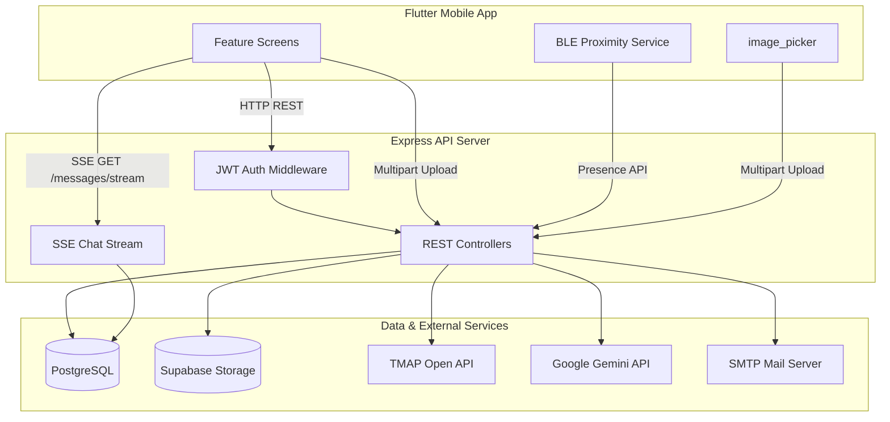

# DanBear & Gretel (단곰이와 그레텔)

**2026-1 캡스톤 디자인 프로젝트** — 단국대학교 이메일 인증 기반 **택시 공동 탑승** 모바일 애플리케이션

동일 목적지·유사 경로를 가진 사용자를 매칭하고, BLE 근접 확인·실시간 채팅·거리 비례 정산을 제공합니다.

---

## 목차

1. [기술 스택](#기술-스택)
2. [시스템 아키텍처](#시스템-아키텍처)
3. [핵심 도메인](#핵심-도메인)
4. [디렉터리 구조](#디렉터리-구조)
5. [사전 요구사항](#사전-요구사항)
6. [환경 변수](#환경-변수)
7. [로컬 실행](#로컬-실행)
8. [데이터베이스 마이그레이션](#데이터베이스-마이그레이션)
9. [API 개요](#api-개요)
10. [관련 문서](#관련-문서)

---

## 기술 스택

| 계층 | 기술 |
|------|------|
| **Client** | Flutter (Dart 3.11+), `image_picker`, `flutter_blue_plus`, `geolocator` |
| **API Server** | Node.js, Express 5, JWT 인증, `express-rate-limit` |
| **Database** | PostgreSQL 15 (PostGIS 이미지, Docker Compose) |
| **Object Storage** | Supabase Storage (프로필·미터기 이미지) |
| **외부 API** | TMAP Open API (POI 검색), Google Gemini (미터기 OCR) |
| **실시간 통신** | SSE (Server-Sent Events) — 채팅 수신 |
| **이메일** | Nodemailer (SMTP, 학교 메일 인증) |
| **지도/내비** | TMAP Mobile SDK (`plugins/tmap_ui_sdk`, `plugins/flutter_navi_sdk`) |

---

## 시스템 아키텍처



### 통신 패턴

| 기능 | Client → Server | Server → Client |
|------|-----------------|-----------------|
| 인증·예약·정산 | REST (`POST` / `GET` / `PUT`) | JSON 응답 |
| 채팅 메시지 전송 | `POST /api/chats/.../messages` | — |
| 채팅 실시간 수신 | `GET .../messages/stream` (SSE) | `event: message`, `event: presence` |
| 이미지 업로드 | `multipart/form-data` (`multer`) | Public URL |
| 장소 검색 | `GET /places/search?q=` | TMAP POI 프록시 |

---

## 핵심 도메인

### 1. 인증 (Auth)
- 단국대 이메일(`@dankook.ac.kr`) 기반 회원가입·로그인
- 이메일 인증 코드 발송·검증 (해시 저장, TTL·시도 횟수 제한)
- JWT Bearer 토큰 기반 API 인가

### 2. 예약 (Reservation)
- 출발지·목적지·출발 시각 기반 카풀 예약 생성
- Haversine 거리 기반 우회 거리(`detour_meters`) 정렬 매칭
- 예약 상태: `READY` → `MATCHED` → `RUNNING` → `COMPLETED`

### 3. 근접 매칭 (BLE Proximity)
- 방장(예약 생성자)이 동승자 선택 후 BLE 근접 확인
- `reservation_bluetooth_participants` 테이블로 참여자·하차 정보 관리

### 4. 채팅 (Chat)
- 예약 단위 채팅방, 메시지 PostgreSQL 영속화
- SSE 단방향 Push로 실시간 메시지·접속자(presence) 동기화

### 5. 정산 (Settlement)
- Haversine 직선 거리 기반 구간별 요금 비례 배분
- 최종 하차자가 미터기 사진 업로드 + Gemini OCR 요금 인식
- 앱 내 잔액(`balance`) 기반 송금 정산

### 6. 미디어 (Image)
- `image_picker`로 갤러리/카메라 선택
- `multer` → Supabase Storage 업로드 (5MB, jpg/png/heic 등)

---

## 디렉터리 구조

```
dangretel/
├── backend/                    # Node.js REST API 서버
│   ├── db/
│   │   ├── schema.sql          # DDL 스키마 정의
│   │   └── migrate.js          # 스키마 마이그레이션 스크립트
│   └── src/
│       ├── index.js            # Express 앱 엔트리포인트
│       ├── controllers/        # HTTP 요청 핸들러
│       ├── services/           # 비즈니스 로직
│       ├── routes/             # 라우트 정의
│       ├── middleware/         # JWT 인증 등
│       ├── db/                 # DB 연결·스키마 보장
│       ├── lib/                # Supabase 클라이언트
│       └── utils/              # 메일 발송 등
│
├── frontend/                   # Flutter 모바일 클라이언트
│   └── lib/
│       ├── main.dart           # 앱 엔트리포인트
│       ├── core/               # 인증 토큰, 공용 위젯
│       ├── data/               # 공용 상수 (색상 등)
│       └── features/           # 기능 단위 모듈 (Feature-first)
│           ├── auth/           # 로그인·회원가입·이메일 인증
│           ├── home/           # 홈·TMAP 지도
│           ├── route_search/   # 장소 검색
│           ├── nearby_mate_list/    # 동승자 목록
│           ├── nearby_mate_detail/  # 예약 상세·생성
│           ├── bluetooth/      # BLE 근접 매칭
│           ├── chat/           # 매칭 채팅 (SSE)
│           ├── settle_up/      # 중도/최종 하차 정산
│           └── setting/        # 프로필·충전·설정
│
├── plugins/                    # Flutter 로컬 플러그인
│   ├── tmap_ui_sdk/            # TMAP 지도 UI SDK
│   └── flutter_navi_sdk/       # TMAP 내비 SDK
│
├── docker-compose.yml          # 로컬 PostgreSQL(PostGIS) 컨테이너
├── .env.example                # Docker DB 환경 변수 예시
└── README.md
```

### Frontend Feature 모듈 규칙

각 `features/<domain>/` 하위는 역할별로 분리합니다.

| 하위 디렉터리 | 역할 |
|---------------|------|
| `screens/` | Route 단위 전체 화면 UI |
| `widgets/` | 화면 전용·재사용 위젯 |
| `services/` | REST API 클라이언트 |
| `models/` | 도메인 모델·계산 로직 |

---

## 사전 요구사항

| 도구 | 버전·비고 |
|------|-----------|
| Node.js | 18+ |
| Flutter SDK | 3.x (`frontend/pubspec.yaml` SDK 제약 참고) |
| Docker Desktop | 로컬 DB 사용 시 |
| TMAP API Key | Open API(백엔드) + Mobile SDK(프론트) 각각 발급 |
| Supabase 프로젝트 | 이미지 Storage 버킷 |
| Google Gemini API Key | 미터기 OCR (선택) |

---

## 환경 변수

### Backend (`backend/.env`)

`backend/.env.example`을 복사해 설정합니다.

| 변수 | 설명 |
|------|------|
| `DATABASE_URL` | PostgreSQL 연결 문자열 |
| `BASE_URL`, `PORT` | API 서버 주소·포트 (기본 `3000`) |
| `JWT_SECRET_KEY`, `JWT_EXPIRES_IN` | JWT 서명·만료(초) |
| `TMAP_API_KEY` | TMAP POI 검색 Open API 키 |
| `MAIL_*` | SMTP 이메일 인증 발송 |
| `SUPABASE_URL`, `SUPABASE_SERVICE_ROLE_KEY`, `SUPABASE_PROFILE_BUCKET` | 이미지 Storage |
| `GEMINI_API_KEY`, `GEMINI_MODEL` | 미터기 요금 OCR |

### Frontend (`frontend/.env`)

`frontend/.env.example`을 복사해 설정합니다.

| 변수 | 설명 |
|------|------|
| `BASE_URL` | 백엔드 API Base URL |
| `TMAP_API_KEY` | TMAP Mobile SDK 키 (백엔드 키와 별도) |

**실기기 연결 시** `BASE_URL`은 PC의 LAN IPv4 주소를 사용합니다.  
Android 에뮬레이터는 일반적으로 `http://10.0.2.2:3000`을 사용합니다.

---

## 로컬 실행

### 1. 데이터베이스 (Docker)

```bash
# 프로젝트 루트
cp .env.example .env
docker compose up -d
```

### 2. Backend

```bash
cd backend
cp .env.example .env   # DATABASE_URL 등 수정
npm install
node db/migrate.js     # 최초 1회 또는 스키마 변경 시
npm run dev            # node --watch src/index.js
```

헬스체크: `GET http://localhost:3000/health`

### 3. Frontend

```bash
cd frontend
cp .env.example .env   # BASE_URL, TMAP_API_KEY 수정
flutter pub get
flutter run            # 연결된 에뮬레이터 또는 실기기
```

웹 실행: `flutter run -d chrome` (BLE·TMAP SDK는 모바일 환경 권장)

---

## 데이터베이스 마이그레이션

스키마 변경 후 테이블 관련 오류가 발생하면 마이그레이션을 재실행합니다.

```bash
cd backend
node db/migrate.js
```

`schema.sql`을 `pg` 클라이언트로 일괄 실행하며, `CREATE TABLE IF NOT EXISTS`·`ADD COLUMN IF NOT EXISTS` 패턴으로 멱등성을 유지합니다.  
런타임 중 일부 스키마(채팅·근접 매칭·정산 컬럼)는 서버 기동 시 `ensure*Schema` 모듈이 추가 보장합니다.

### 주요 테이블

| 테이블 | 용도 |
|--------|------|
| `users` | 사용자·프로필·잔액 |
| `email_verifications` | 이메일 인증 코드 |
| `reservations` | 카풀 예약·좌표·상태 |
| `reservation_bluetooth_participants` | BLE 참여·하차 거리·정산 |
| `chat_messages` | 예약 채팅 메시지 |
| `reservation_settlements` | 정산 요청·총 요금 |
| `payments` | 미터기 이미지 URL |

---

## API 개요

Base URL: `{BASE_URL}` (인증 필요 엔드포인트는 `Authorization: Bearer <JWT>`)

| Prefix | 주요 엔드포인트 | 설명 |
|--------|-----------------|------|
| `/auth` | `POST /signup`, `/login`, `/email/send-code`, `/email/verify-code` | 인증 |
| `/api/user` | `GET/PUT /profile`, `POST /charge` | 프로필·잔액 충전 |
| `/api/reservations` | `POST /create`, `GET /all`, `GET /active-match` | 예약 CRUD·매칭 |
| `/api/bluetooth` | `POST /confirm`, `/proximity/:id/*` | BLE 근접 매칭 |
| `/api/chats` | `GET/POST .../messages`, `GET .../stream` | 채팅 (SSE) |
| `/api/settle` | `POST .../dropoff`, `/request`, `/transfer` | 정산 |
| `/api/image` | `POST /profile/upload`, `/taxi_meter/upload`, `/extract` | 이미지 |
| `/places/search` | `GET ?q=` | TMAP POI 검색 프록시 |
| `/health` | `GET` | 서버·DB 상태 |

---

## 관련 문서

| 파일 | 내용 |
|------|------|
| [`backend/.env.example`](backend/.env.example) | 백엔드 환경 변수 템플릿 |
| [`frontend/.env.example`](frontend/.env.example) | 프론트엔드 환경 변수 템플릿 |
| [`backend/README_RENDER.md`](backend/README_RENDER.md) | Render 배포·이메일 인증 보안 가이드 |
| [`backend/db/schema.sql`](backend/db/schema.sql) | DB 스키마 DDL |

---

## 라이선스

캡스톤 디자인 프로젝트 — 학술·비상업 목적
